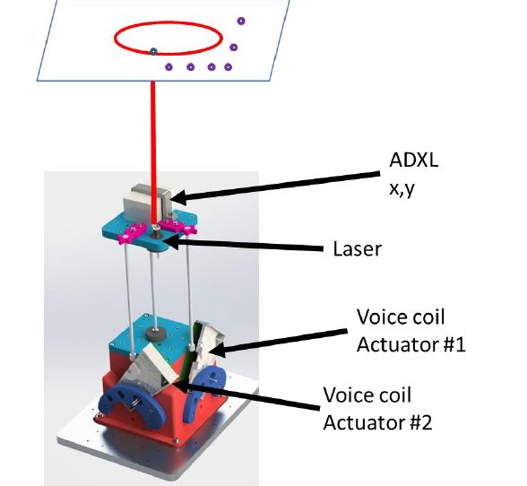

# MicroController-Wiggler
Two voice-coil motors are used to move a laser

1) STM microcontroller
2) Waijung for simulink communication 
3) Polynomial calibration
4) Matlab GUI

*) STM files not added to git. They are too extensive

